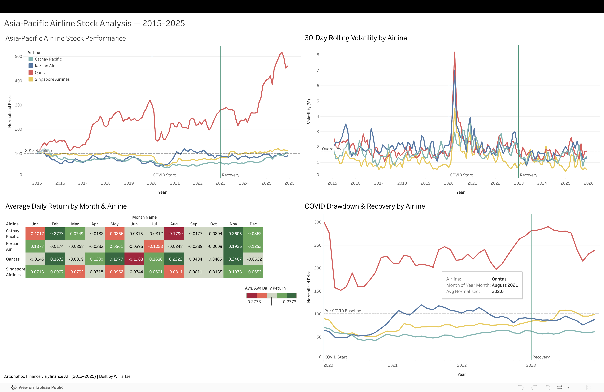

# Asia-Pacific Airline Stock Analysis — 2015–2025
 

 
> **An data analytics project** analysing the stock performance of 4 major Asia-Pacific airlines — Cathay Pacific, Singapore Airlines, Qantas, and Korean Air — across 11 years (2015–2025), covering pre-COVID growth, pandemic collapse, and the ongoing recovery.

[](https://www.python.org/)
[](https://www.postgresql.org/)
[](https://public.tableau.com)
[](https://pypi.org/project/yfinance/)
 
---

📌 Project Summary
 
| | |
|---|---|
| **Airlines** | Cathay Pacific (0293.HK), Singapore Airlines (C6L.SI), Qantas (QAN.AX), Korean Air (003490.KS) |
| **Period** | January 2015 – December 2025 (11 years) |
| **Data source** | Yahoo Finance via yfinance API |
| **Tools** | Python, pandas, matplotlib, seaborn, PostgreSQL, SQL, Tableau Public |
| **Goal** | Build a complete data pipeline from API → database → SQL analysis → interactive dashboard |
 
---

## 🧭 About This Project
 
This project extends my [Cathay Pacific Operations Analysis](https://github.com/williscy/CX_project) by adding a financial market perspective — analysing how investor sentiment and stock prices reflected the operational reality of Asia-Pacific airlines through one of the most turbulent periods in aviation history.
 
Rather than using a pre-cleaned dataset, I built the pipeline from scratch: fetching raw stock data from Yahoo Finance using the yfinance API, cleaning and transforming it with pandas, loading it into PostgreSQL, writing SQL queries to extract insights, and visualising the findings in an interactive Tableau dashboard.
 
---
## Key Findings
 
- 📉**All 4 airlines crashed simultaneously in March 2020** — stock prices dropped 50–70% within weeks of the WHO pandemic declaration
- 🇦🇺 **Qantas was the biggest winner long-term** — 5x growth from its 2015 baseline by 2025, driven by domestic Australia's early reopening and aggressive fleet restructuring
- 🇰🇷 **Korean Air showed the most anomalous behaviour** — crashed to 34% of baseline in March 2020, then rocketed to 183% by early 2021 due to government bailout funds and speculative trading, all while passenger numbers were near-zero
- 🇸🇬 **Singapore Airlines was the most resilient** — lowest volatility throughout, most stable recovery
- 🇭🇰 **Cathay Pacific was the slowest to recover** — didn't cross back above its pre-COVID stock price until November 2024, directly reflecting Hong Kong's uniquely prolonged border closure policy (closed until early 2023)
- 📅 **November is universally the best month** for all 4 airlines — consistent positive returns across the full 11-year period
- ⚡ **COVID tripled volatility overnight** — Qantas peaked at 8.6% 30-day rolling volatility in March 2020 vs. its pre-COVID average of ~2%
---
## Project Structure
 
```
airline_stock_project/
├── README.md
├── data/
│   ├── raw/
│   │   └── all_airlines_raw.csv          # Raw daily prices from yfinance
│   └── processed/
│       ├── all_airlines_combined.csv     # Cleaned daily data
│       ├── all_airlines_monthly.csv      # Monthly aggregated data
│       └── airline_stock_tableau.csv     # Flat file for Tableau import
├── python/
│   ├── 1_fetch_data.py                   # Pull stock data from yfinance API
│   ├── 2_clean_and_process.py            # Clean, normalise, calculate returns & volatility
│   └── 3_visualise.py                    # Build 4 matplotlib/seaborn charts
├── sql/
│   ├── 0_create_tables.sql               # Schema: stock_daily & stock_monthly
│   ├── 1_covid_volatility.sql            # Volatility ranking during COVID
│   ├── 2_max_drawdown.sql                # Maximum drawdown per airline
│   ├── 3_recovery_speed.sql              # When each airline crossed back above baseline
│   └── 4_best_worst_month.sql            # Best and worst month per airline
└── dashboard/
    └── airline_stock_dashboard.png
```
 
---
## Data Pipeline
 
```
Yahoo Finance API
      │
      ▼
1_fetch_data.py          → Pull 10,950 rows of daily closing prices (4 airlines × ~11 years)
      │
      ▼
2_clean_and_process.py   → Calculate daily returns, normalised prices (base 100),
                           30-day rolling volatility, monthly aggregations
      │
      ▼
PostgreSQL Database       → stock_daily (10,950 rows) + stock_monthly (528 rows)
      │
      ▼
SQL Queries              → Volatility ranking, max drawdown, recovery speed, seasonal patterns
      │
      ▼
Tableau Public Dashboard → 4-chart interactive dashboard
```
 
---
 
## Dashboard
 
**🔗 Live dashboard:** [Tableau Public — Asia-Pacific Airline Stock Analysis 2015–2025](https://public.tableau.com/views/Asia-PacificAirlineStockAnalysis2015-2025/Dashboard1?:language=en-US&publish=yes&:sid=&:redirect=auth&:display_count=n&:origin=viz_share_link)
 
| # | Chart | Type | Key Insight |
|---|---|---|---|
| 1 | Stock Performance | Multi-line | Qantas 5x growth, Cathay still below 2015 baseline |
| 2 | Rolling Volatility | Multi-line | COVID tripled volatility, SIA consistently calmest |
| 3 | Monthly Return Heatmap | Heatmap | November universally best, seasonal patterns clearly visible |
| 4 | COVID Drawdown & Recovery | Multi-line | All airlines crashed together, recovered at very different speeds |
 
---
